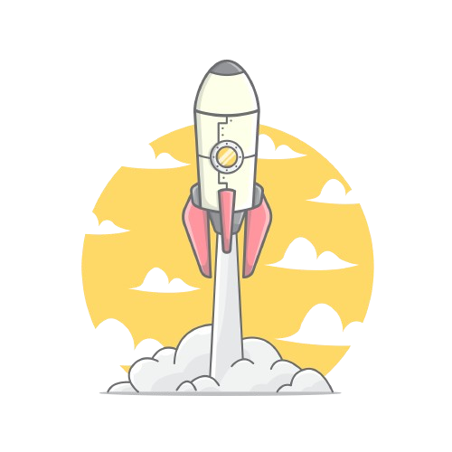

<!-- Improved compatibility of back to top link: See: https://github.com/othneildrew/Best-README-Template/pull/73 -->
<a name="readme-top"></a>


<!-- PROJECT SHIELDS -->
<!--
*** I'm using markdown "reference style" links for readability.
*** Reference links are enclosed in brackets [ ] instead of parentheses ( ).
*** See the bottom of this document for the declaration of the reference variables
*** for contributors-url, forks-url, etc. This is an optional, concise syntax you may use.
*** https://www.markdownguide.org/basic-syntax/#reference-style-links
-->
[![Contributors][contributors-shield]][contributors-url]
[![Forks][forks-shield]][forks-url]
[![Stargazers][stars-shield]][stars-url]
[![Issues][issues-shield]][issues-url]
[![MIT License][license-shield]][license-url]


<!-- PROJECT LOGO -->
<br />
<div align="center">
  <a href="https://github.com/sarvsav/go-starter-template">
    
  </a>

<h3 align="center">Go Starter Template</h3>

  <p align="center">
    A boiler plate for your Go project with best practices
    <br />
    <a href="https://sarvsav.github.io/go-starter-template/"><strong>📘 Explore the docs  »</strong></a>
    <br />
    <br />
    <a href="https://calendly.com/sarvsav">📅 Book a meeting</a>
    ·
    <a href="https://github.com/sarvsav/go-starter-template/issues/new?assignees=sarvsav&labels=bug%2Cneeds-triage&projects=&template=01_bug_report.yml">🐛 Report Bug</a>
    ·
    <a href="https://github.com/sarvsav/go-starter-template/issues/new?assignees=sarvsav&labels=enhancement%2Cneeds-triage&projects=&template=02_feature_request.yml"> 🔨 Request Feature</a>
  </p>
</div>


<!-- TABLE OF CONTENTS -->
<details>
  <summary>Table of Contents</summary>
  <ol>
    <li>
      <a href="#about-the-project">About The Project</a>
      <ul>
        <li><a href="#built-with">Built With</a></li>
      </ul>
    </li>
    <li>
      <a href="#getting-started">Getting Started</a>
      <ul>
        <li><a href="#prerequisites">Prerequisites</a></li>
        <li><a href="#installation">Installation</a></li>
      </ul>
    </li>
    <li><a href="#usage">Usage</a></li>
    <li><a href="#roadmap">Roadmap</a></li>
    <li><a href="#license">License</a></li>
    <li><a href="#contact">Contact</a></li>
    <li><a href="#contributors">Contributors</a></li>
    <li><a href="#acknowledgments">Acknowledgments</a></li>
    <li><a href="#thankyou">Thank You</a></li>
  </ol>
</details>


<!-- ABOUT THE PROJECT -->
## About The Project

[![Go Starter Template][product-screenshot]](https://sarvsav.github.io/go-starter-template/)

This is a starter template for your `go` based projects. It is supercharged with latest technologies like `bazel`, `grpc`, `linters`, and much more. The new updates related to features, bug fixes, and securities will keep on adding with newer version of the template. The detailed version can be found on [project website](https://sarvsav.github.io/go-starter-template/).

<p align="right">(<a href="#readme-top">back to top</a>)</p>


### Built With

[![Go][Golang]][Go-url]
<br>
[![Bazel][Bazel]][Bazel-url]
<br>
[![docusaurus][docusaurus]][docusaurus-url]

<p align="right">(<a href="#readme-top">back to top</a>)</p>


<!-- GETTING STARTED -->
## Getting Started

This is an example of how you may give instructions on setting up your project locally.
To get a local copy up and running follow these simple example steps.

### Prerequisites

There is an interactive bash script named `main.bash`  located inside the `scripts` folder, that will install all the required dependencies and logs the information in `log` directory. You can run it by running below command from the project root.

```bash
./scripts/main.bash
```


### Installation

The installation will be available after the first release of the product. Currently, you can use this as a template, by clicking the top icon and use template.

<!-- USAGE EXAMPLES -->
## Usage

Choose the option `Use this template` for your new project as a boilerplate for it.


_For more information, please refer to the [Documentation](https://sarvsav.github.io/go-starter-template/)_

<p align="right">(<a href="#readme-top">back to top</a>)</p>


<!-- ROADMAP -->
## Roadmap

- [ ] Add database layer
    - [ ] Add goose for migration
    - [ ] Add sqlc for code generation
- [ ] Add queue using nats
- [ ] Enhance bash scripts
- [ ] Add CLI to generate this template
    - [ ] Add subcommand for help

See the [open issues](https://github.com/sarvsav/go-starter-template/issues) for a full list of proposed features (and known issues).

<p align="right">(<a href="#readme-top">back to top</a>)</p>


<!-- LICENSE -->
## License

Distributed under the MIT License. See [LICENSE](./LICENSE) for more information.

<p align="right">(<a href="#readme-top">back to top</a>)</p>


<!-- CONTACT -->
## Contact

Discord Server - [Go Starter Template](https://discord.gg/ZNHGGGDsNe)

Project Link: [https://github.com/sarvsav/go-starter-template](https://github.com/sarvsav/go-starter-template)

<p align="right">(<a href="#readme-top">back to top</a>)</p>

<!-- CONTRIBUTORS -->
## Contributors

Big thanks to our contributors.

<a href="https://github.com/sarvsav/go-starter-template/graphs/contributors">
  
</a>

Made with [contrib.rocks](https://contrib.rocks).

Kindly refer to the [contributing guide](./CONTRIBUTING.md) to contribute to the project.

<p align="right">(<a href="#readme-top">back to top</a>)</p>

<!-- ADOPTERS -->
## Adopters

📢 If you're using go-starter-template in your organization, please add your name or company name to this [list](./ADOPTERS.md).

By adding yourself to the [ADOPTERS.md](./ADOPTERS.md) file, you help increase the project's visibility and credibility, which is essential for its growth.

<p align="right">(<a href="#readme-top">back to top</a>)</p>

<!-- ACKNOWLEDGMENTS -->
## Acknowledgments

* [Best-README-Template](https://github.com/othneildrew/Best-README-Template)

<p align="right">(<a href="#readme-top">back to top</a>)</p>

<!-- Thank You -->
## Thankyou

If you appreciate this project, please consider showing your support by ⭐ starring it, 🔄 sharing it with your friends, or 💖 making a donation. Thank you!

<!-- MARKDOWN LINKS & IMAGES -->
<!-- https://www.markdownguide.org/basic-syntax/#reference-style-links -->
[contributors-shield]: https://img.shields.io/github/contributors/sarvsav/go-starter-template.svg?style=for-the-badge
[contributors-url]: https://github.com/sarvsav/go-starter-template/graphs/contributors
[forks-shield]: https://img.shields.io/github/forks/sarvsav/go-starter-template.svg?style=for-the-badge
[forks-url]: https://github.com/sarvsav/go-starter-template/network/members
[stars-shield]: https://img.shields.io/github/stars/sarvsav/go-starter-template.svg?style=for-the-badge
[stars-url]: https://github.com/sarvsav/go-starter-template/stargazers
[issues-shield]: https://img.shields.io/github/issues/sarvsav/go-starter-template.svg?style=for-the-badge
[issues-url]: https://github.com/sarvsav/go-starter-template/issues
[license-shield]: https://img.shields.io/github/license/sarvsav/go-starter-template.svg?style=for-the-badge
[license-url]: https://github.com/sarvsav/go-starter-template/blob/master/LICENSE.txt
[product-screenshot]: assets/go-starter-template.png
[Golang]: https://img.shields.io/github/go-mod/go-version/sarvsav/go-starter-template?style=for-the-badge&logo=go
[Go-url]: https://go.dev/
[Bazel]: https://img.shields.io/badge/Bazel-v7-brightgreen?style=for-the-badge&logo=bazel
[Bazel-url]: https://bazel.build/
[docusaurus]: https://img.shields.io/badge/docs-passing-green?style=for-the-badge&logo=docusaurus&logoColor=%233ECC5F
[docusaurus-url]: https://docusaurus.io/